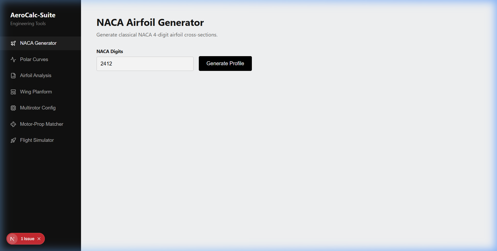
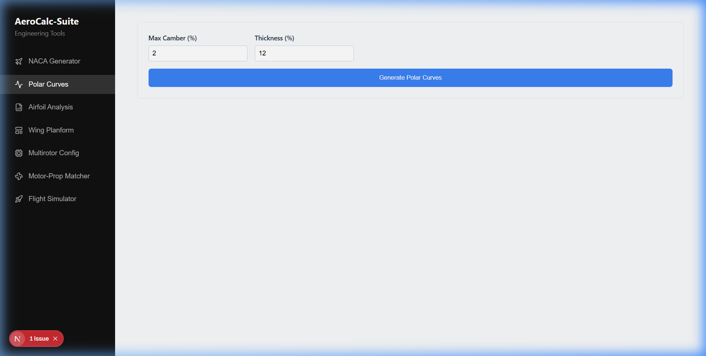
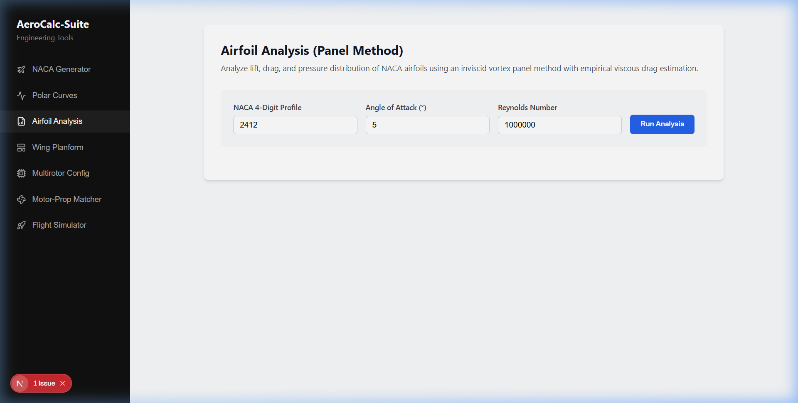
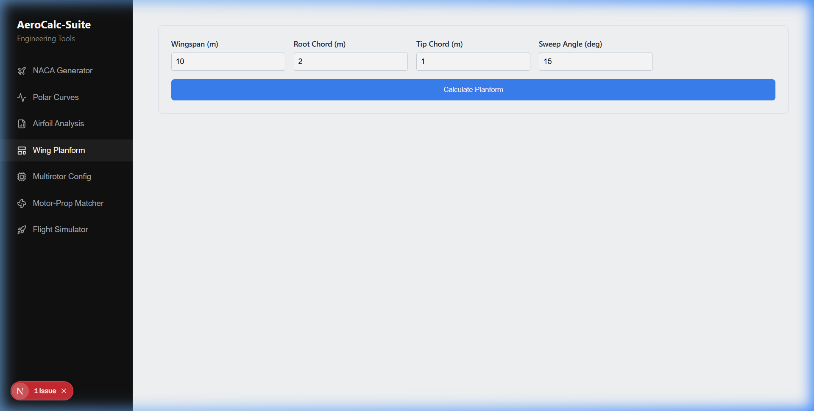
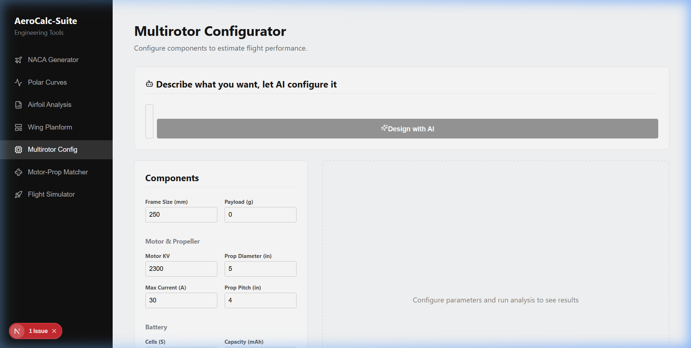
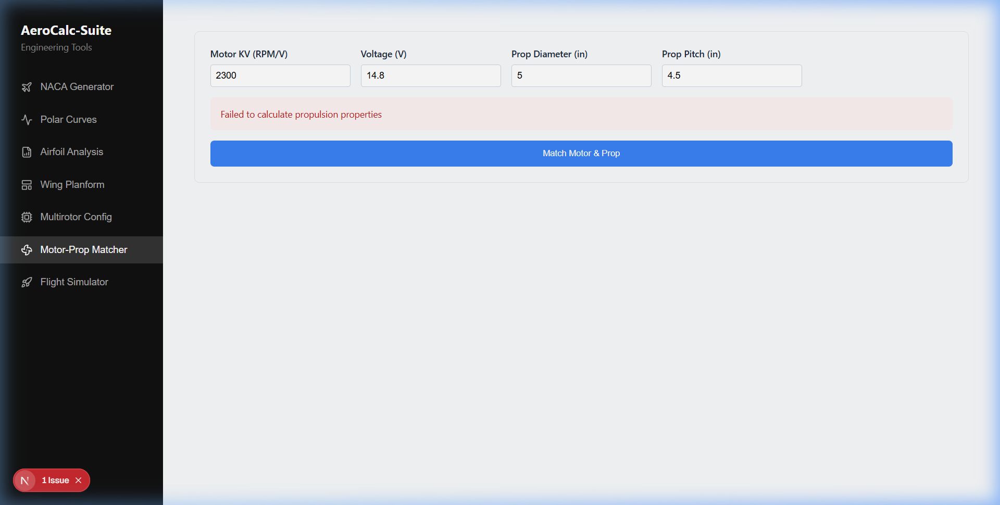
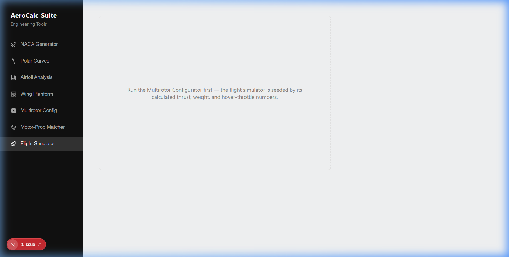
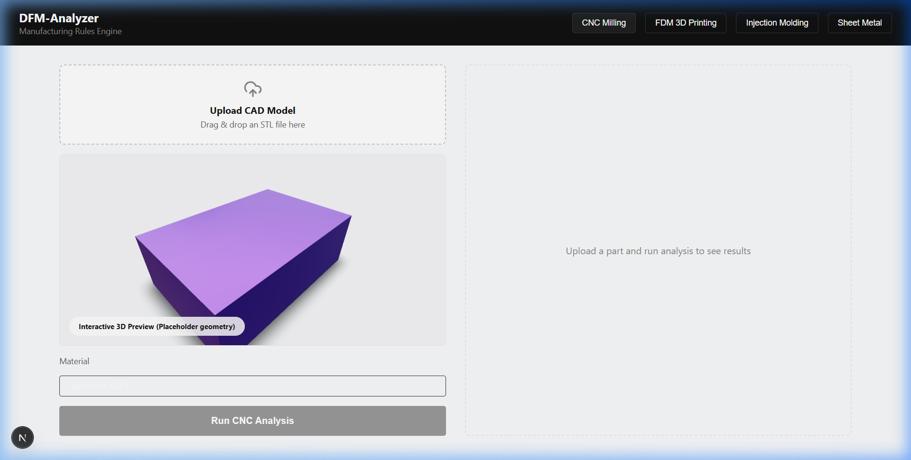
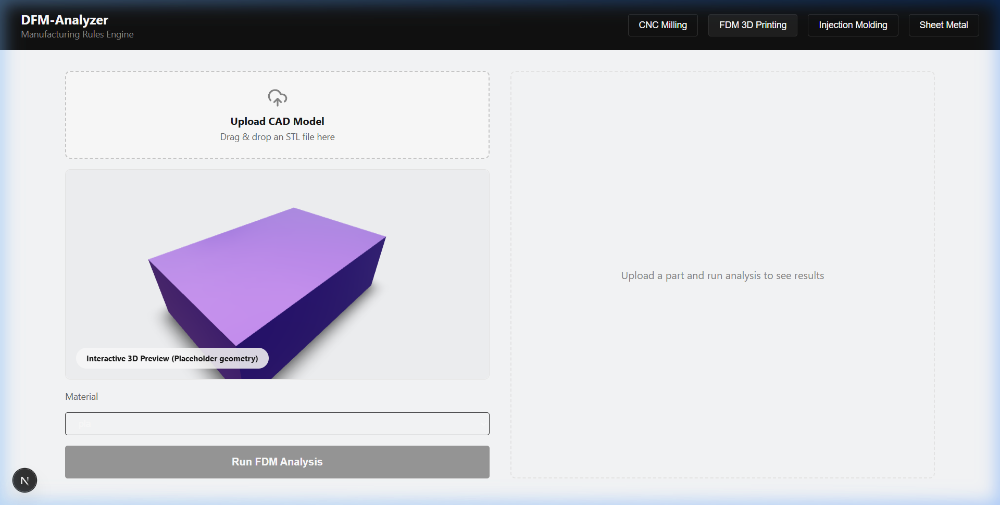
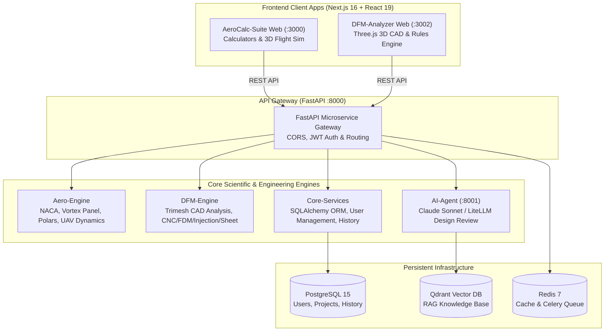

# AeroCalc DFM (AeroCalc-Suite & DFM-Analyzer)

[](https://turbo.build/)
[](https://nextjs.org/)
[](https://react.dev/)
[](https://fastapi.tiangolo.com/)
[](https://python.org/)
[](https://threejs.org/)
[](https://www.docker.com/)
[](https://www.w3.org/WAI/standards-guidelines/wcag/)
[](https://opensource.org/licenses/MIT)

> **AeroCalc DFM** is a production-grade, open-source engineering suite that unifies **aerodynamic design calculations** with **Design for Manufacturing (DFM) CAD validation**. It bridges the gap between aerodynamic performance optimization and real-world manufacturing constraints (CNC milling, FDM 3D printing, injection molding, and sheet metal fabrication).

---

## 📸 Application Screenshots

### AeroCalc-Suite: Aerodynamics & UAV Engineering

| NACA Airfoil Generator | Polar Curve Generator |
| :---: | :---: |
|  |  |
| *Interactive 4-digit airfoil geometry generation with coordinate export* | *Lift, drag, and moment coefficient polars across angle of attack* |

| Airfoil Analysis (Panel Method) | Wing Planform Designer |
| :---: | :---: |
|  |  |
| *Vortex panel method analysis with surface pressure distribution* | *Wing geometry: span, taper ratio, sweep, MAC, and aspect ratio* |

| Multirotor Configurator | Motor-Propeller Matcher |
| :---: | :---: |
|  |  |
| *Drone sizing, thrust-to-weight, hover throttle, and flight time analysis* | *Brushless motor KV, voltage, static thrust, and electrical power* |

| 3D Drone Flight Simulator |
| :---: |
|  |
| *Interactive 3D flight physics simulator built on Three.js & Rapier WASM* |

---

### DFM-Analyzer: Manufacturing Rules Engine & CAD Analysis

| CNC Milling Manufacturability Analysis | FDM 3D Printing & Additive Manufacturing |
| :---: | :---: |
|  |  |
| *Tool access, internal corner radii, pocket depth, and cost estimation* | *Overhang angle detection, support volume, and layer thickness rules* |

---

## 🏛️ System Architecture



---

## 🚀 Key Features

### 1. Classical Aerodynamics & Aircraft Design
- **NACA 4-Digit Generator**: Parametric airfoil geometry generation with camber, thickness distributions, and coordinate export (CSV/DAT).
- **Polar Curve Generator**: Thin airfoil theory and empirical corrections for $C_L$, $C_D$, and $C_M$ vs. angle of attack ($\alpha$) including stall behavior.
- **Airfoil Analysis (Vortex Panel Method)**: Inviscid flow modeling with surface velocity and pressure coefficient ($C_p$) distribution.
- **Wing Planform Designer**: Full 3D wing layout computation (aspect ratio, taper ratio, sweep angle, mean aerodynamic chord, surface area).

### 2. Drone & UAV Propulsion Systems
- **Multirotor Configurator**: Quadcopter, hexacopter, and octocopter optimization. Calculates total AUW, thrust-to-weight ratio (TWR), hover throttle %, maximum climb rate, and battery endurance.
- **Motor-Propeller Matcher**: Physics-accurate blade element and momentum theory calculating static thrust ($C_T$), mechanical/electrical power absorption ($C_P$), current draw, and pitch speed.
- **3D Interactive Flight Simulator**: Client-side flight simulation with WebGL rendering and Rapier WASM rigid body physics.

### 3. Design for Manufacturing (DFM) Rules Engine
- **Interactive 3D STL CAD Viewer**: WebGL mesh inspector with real-time rotation, zoom, pan, and lighting controls.
- **CNC Milling Analyzer**: Evaluates minimum internal radius, pocket depth-to-width aspect ratio, thin walls, and undercut detection.
- **FDM 3D Printing Analyzer**: Detects critical overhang angles (>45°), unsupportable bridges, minimum feature size, and support material volume.
- **Injection Molding Analyzer**: Verifies draft angles (1°–2° minimum), nominal wall thickness uniformity, rib sizing (0.5–0.7x wall thickness), and sink mark risks.
- **Sheet Metal Analyzer**: Validates minimum bend radii relative to thickness, hole-to-edge clearances, and bend relief notches.
- **Comprehensive Cost Estimation**: Itemized breakdown of raw material costs, machine setup, cycle time machining rates, and batch volume scaling.
- **AI Design Review Assistant**: Provides actionable manufacturing engineering feedback and design-for-manufacturability recommendations.

---

## 📁 Repository Structure

```text
aerocalcdfm/
├── apps/
│   ├── aerocalc-web/          # Next.js 16 Aerodynamics & Flight Sim web app (:3000)
│   ├── dfm-analyzer-web/      # Next.js 16 3D CAD DFM analysis web app (:3002)
│   └── api-gateway/           # FastAPI backend microservice gateway (:8000)
├── backend-modules/
│   ├── aero-engine/           # Python engine: NACA generator, panel method, UAV physics
│   ├── dfm-engine/            # Python engine: Trimesh geometry, CNC/FDM/Injection/Sheet rules
│   └── core-services/         # Database models, Alembic migrations, JWT authentication
├── core-services/
│   └── ai-agent/              # AI Design Assistant service (Claude / LiteLLM) (:8001)
├── docs/
│   └── screenshots/           # High-resolution application screenshots
├── packages/
│   ├── eslint-config/         # Shared ESLint configuration
│   ├── typescript-config/     # Shared TypeScript tsconfig
│   └── ui/                    # Shared React design system component library
├── docker-compose.yml         # 1-click Docker orchestration
├── package.json               # Root monorepo workspace configuration
├── turbo.json                 # Turborepo task pipeline configuration
└── LICENSE                    # MIT Open Source License
```

---

## ⚡ Quickstart Guide

### Option A: 1-Click Launch with Docker Compose (Recommended)

1. **Clone the repository**:
   ```bash
   git clone https://github.com/Jason-jo17/Aero_cal.git
   cd Aero_cal
   ```

2. **Configure environment variables**:
   ```bash
   cp .env.example .env
   ```

3. **Start all services**:
   ```bash
   docker compose up --build
   ```

4. **Access the services**:
   - **AeroCalc-Suite Web**: [http://localhost:3000](http://localhost:3000)
   - **DFM-Analyzer Web**: [http://localhost:3001](http://localhost:3001) *(or :3002 in local dev)*
   - **FastAPI Gateway Swagger Docs**: [http://localhost:8000/docs](http://localhost:8000/docs)
   - **AI Agent API**: [http://localhost:8001/docs](http://localhost:8001/docs)

---

### Option B: Local Development Setup

#### Prerequisites
- **Node.js**: >= 18.0.0 (v20+ recommended)
- **npm**: >= 10.0.0
- **Python**: 3.10+ (Python 3.11 recommended)

#### 1. Frontend Workspace Setup
```bash
# Install monorepo dependencies
npm install

# Run type checks across all workspaces
npm run check-types

# Start both web applications concurrently
npm run dev
```

#### 2. Python Backend Setup
```bash
# Create and activate virtual environment
python -m venv .venv
source .venv/bin/activate  # On Windows: .venv\Scripts\activate

# Install editable packages and requirements
pip install -e backend-modules/aero-engine
pip install -e backend-modules/dfm-engine
pip install -e backend-modules/core-services
pip install -r apps/api-gateway/requirements.txt

# Start the API Gateway
cd apps/api-gateway
python -m uvicorn api_gateway.main:app --host 127.0.0.1 --port 8000 --reload
```

#### 3. Run Automated Tests
```bash
# Run API endpoint and physics calculation tests
python test_api.py
```

---

## 📡 API Reference Overview

The API Gateway provides high-performance asynchronous REST endpoints:

| Method | Endpoint | Description |
| :--- | :--- | :--- |
| `POST` | `/aero/naca` | Generate coordinates for NACA 4-digit airfoils |
| `POST` | `/aero/polar-curves` | Compute lift ($C_L$), drag ($C_D$), and moment ($C_M$) polars |
| `POST` | `/aero/airfoil-analysis` | Vortex panel method flow analysis |
| `POST` | `/aero/wing-planform` | Wing geometry, aspect ratio, taper, and MAC calculation |
| `POST` | `/aero/multirotor` | UAV multirotor flight performance & sizing estimation |
| `POST` | `/propulsion/motor-prop-match` | Brushless motor & propeller static thrust and power match |
| `POST` | `/dfm/analyze-cnc` | CNC milling rule checks & cost estimation on STL meshes |
| `POST` | `/dfm/analyze-fdm` | 3D printing overhang & support volume analysis |
| `POST` | `/dfm/analyze-injection` | Injection molding draft & nominal wall analysis |
| `POST` | `/dfm/analyze-sheet-metal` | Sheet metal bend radius & relief checking |
| `POST` | `/auth/register` | User registration (JWT Bearer authentication) |
| `POST` | `/auth/login` | User login token issuance |

Interactive OpenAPI documentation is automatically available at `http://localhost:8000/docs`.

---

## ♿ Accessibility & Cross-Platform Commitment

- **WCAG 2.2 AA Compliant**: All interactive components are engineered with accessible contrast ratios, visible focus indicators, screen-reader text labels, and full keyboard navigation support.
- **Cross-Platform**: All Python modules, Next.js applications, and test harnesses are tested and validated across Windows, macOS, and Linux.
- **Local-First & Privacy-First**: No telemetry, tracking, or user data collection. All calculations run locally on your hardware.

---

## 🤝 Contributing

We welcome contributions from aerodynamicists, mechanical engineers, and developers!

1. Fork the Project
2. Create your Feature Branch (`git checkout -b feature/AmazingFeature`)
3. Commit your Changes (`git commit -m 'Add some AmazingFeature'`)
4. Push to the Branch (`git push origin feature/AmazingFeature`)
5. Open a Pull Request

---

## 📄 License

Distributed under the **MIT License**. See [`LICENSE`](LICENSE) for more information.
